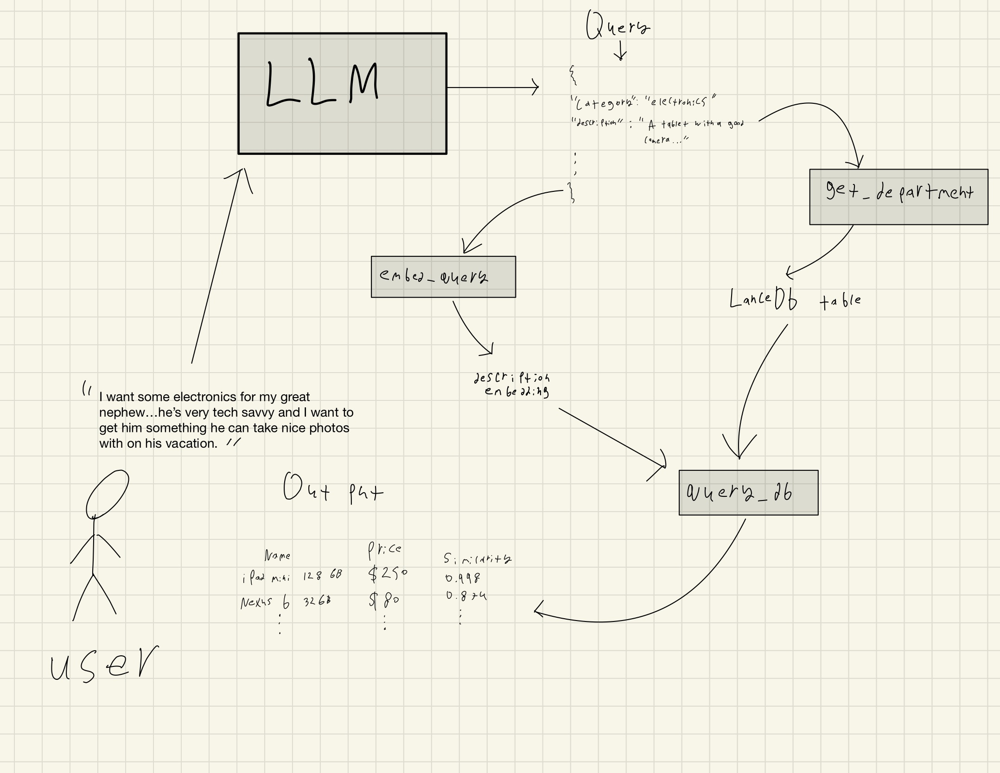

# general-store-RAG

## Dependencies
The dependencies are listed in the requirements.txt folder. They can be installed by running:   
<code>pip install -r requirements.txt
</code>

## Api Keys - Setup Required
This project uses a GPT 3.5 for the LLM portion of the RAG. The API keys are obviously not included in this public repo. To add your own API key, create a .env file in the root directory and add this:  
<code>open_ai_key = sk-your-api-key-here
</code>

## Lance DB Setup
Due to it's modest size, the databse is included in it's entirety on the repo. However, on different machines the database may behave differently. If the database is not behaving properly, run (from the project root directory, or else it will not work):  
<code>python3 build_database/build_vector_db.py
</code>  
This will populate the general store with three tables, 'electronics', 'food', and 'pet supplies' meta data and vector embeddings.

## Usage
With that setup out of the way, execute <code>main.py</code> in the project root directory.

## Testing
In order to run the unit tests, execute <code>python -m unittest discover</code> in the project root directory.

## Components 
For this app, there are 3 main components that interact.
<ol>
<strong><li>  The Database  </strong> 
The LanceDB database lives in the <code>general_store_db</code> directory in the projects root folder. This contains all the items for the general store and is divied up into three main tables, each representing their own department (food, electronics, and pet supplies).  
In order for this database to be populated, <code>build_vector_db.py</code> must be run <strong>from the project's root directory.</strong> If it's run from the <code>build_databse</code> directory, it will exist inside that directory and <code>main.py</code> will error. 
 
The databse is built off of product metadata that is stored in <code>product_meta_data.py</code> as an array of dicts. (I understand this is not realistic, but for the scope of this project I deemed it a necessary shortcut). When the databse is being built, all existing tables will be dropped. The metadata will be imported, and each products description will be embedded with a sentence transformer and the vector stores alongside the product. These will be written to the <code>general_store_db</code> directory, and the food, electronics, and pet supplies will all be added to their own respective tables.
</li>

<strong><li>The RAG</strong> 
The RAG is implemented within the <code>query_utils.py</code>
To better understand the RAG process and visualize the flow, refer to the following diagram (apologies for hand drawn diagram): 

The user input is taken and parsed into the LLM. The LLM is prompted to return only a JSON string with relevant properties for filtering and retrieving from the database. The JSON, when parsed into a dictionary, is referred to as the "query" in the code. These include the min and max price, the department (referred to in the code as "category"), the query to embed (which is referred to as the "description" in the code) among others. The LLM function <code>query_LLM</code> will parse and return this dictionary or None if the LLM fails to return valid JSON for this context. If I were to spend more time on this, I would use LangChain to handle this more eloquantly. The <strong>temperature</strong> of the prompt is kept low to reduce the probability of this happening, and to keep the queries on topic. The goal is to factor out unrelated details and get information relevant to the product. 

From there, the description is embedded and the department is extracted. With the description embedding as our queury, we search the relevant departments table in the database using cosine similarites (all embeddings in the database, as well as our query, have been normalized for optimal performance) as our metric and apply the relevant filters. From there, a Pandas dataframe is returned to be displayed to the user. 
</li>

<strong><li>Main</li></strong>   The main is compartively straightforward. It prints some ASCII art and has a while True loop for prompting the user, calling the RAG, and printing out the results. In case there is an error due to the LLM returning invalid JSON, this is caught and the loop continues. The relevant items are printed out to the user using the pandas dataframe <code>head()</code> method.
</ol>